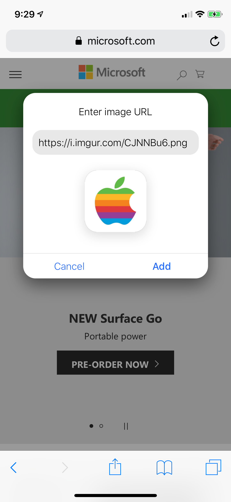

# add-homescreen-icon

A bookmarklet for iOS devices that adds a `apple-touch-icon` to websites that do not support the feature yet.

## Install

Install dependencies with

```
npm install
```

## Build

To build the bookmarklet run

```
npm run build
```

This will minify and insert the html and css files into the javascript file using gulp. It will then generate a bookmarklet.txt file which contains the minified javascript. Use this to create a bookmarklet by pasting it bookmark's `Address` field.

```
npm run build:copy
```

This command will build and copy the output into your clipboard. _macOS only_

## Example

Click for video walkthrough of the process
[](https://youtu.be/cxIMJ4O9wLM)
